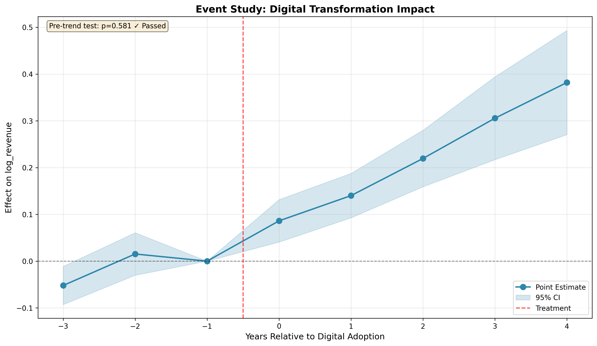
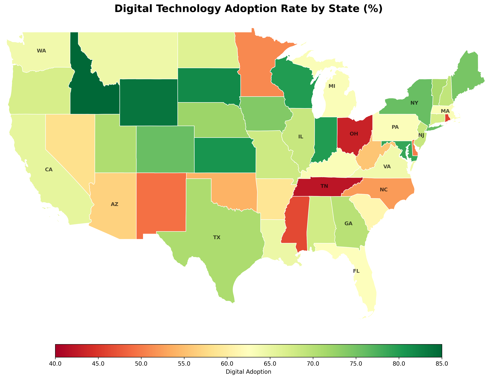
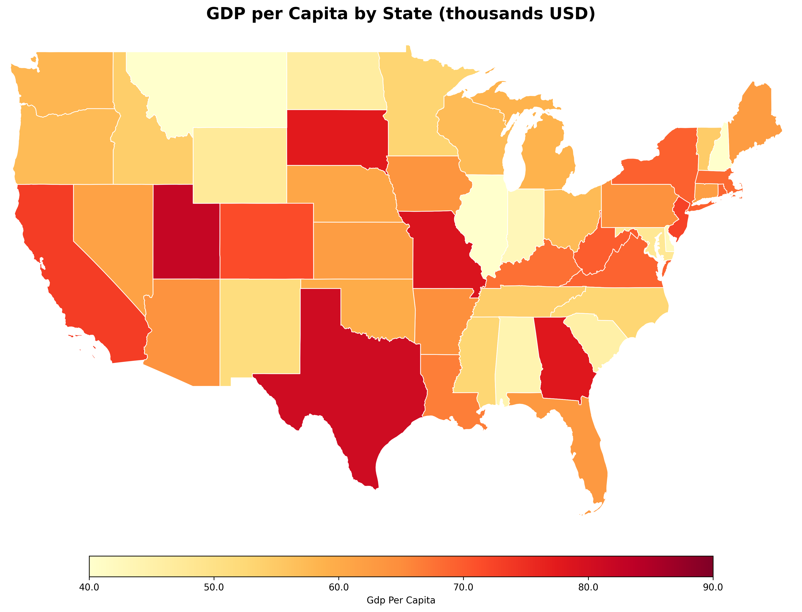
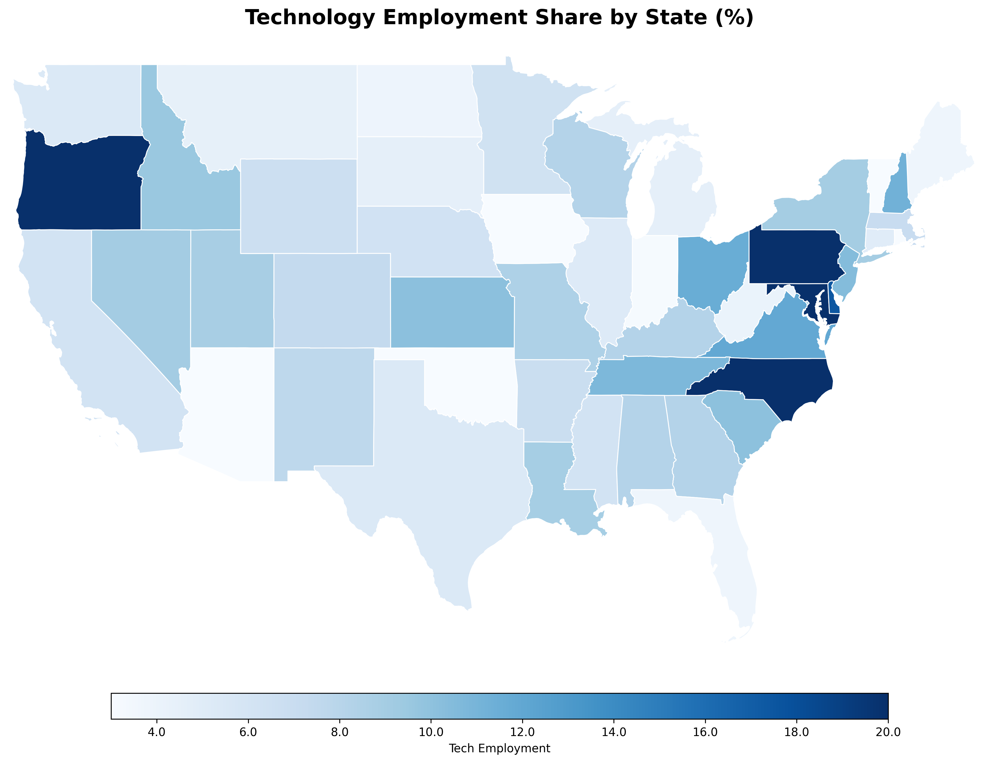
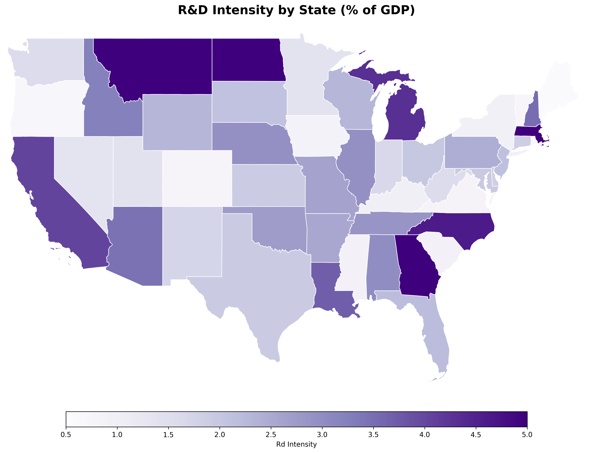
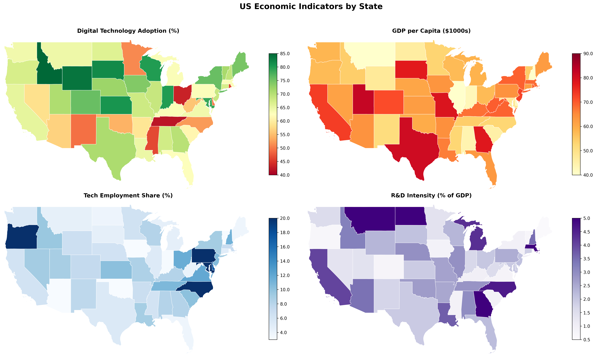
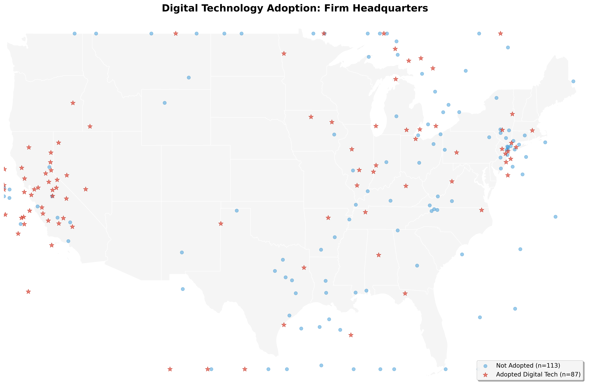

# Firm Digitalization Study

Applied Econometrics Code Sample for Research Position Applications

## Overview

This repository demonstrates end-to-end empirical research capabilities, combining causal inference, structural estimation, and geospatial analysis.

## Key Results

### Difference-in-Differences Estimates

| Event Time | Coefficient | Std. Error | P-value |
|------------|-------------|------------|---------|
| -3 | -0.052 | 0.021 | 0.012 |
| -2 | 0.015 | 0.023 | 0.509 |
| 0 | 0.086 | 0.023 | 0.000 |
| +1 | 0.140 | 0.024 | 0.000 |
| +2 | 0.219 | 0.031 | 0.000 |
| +3 | 0.306 | 0.045 | 0.000 |
| +4 | 0.382 | 0.057 | 0.000 |

**Interpretation**: No significant pre-trends validate parallel trends assumption. Treatment effects grow from 8.6% at adoption to 38.2% after four years.

<p align="center">
  
</p>

## Geographic Distribution of Economic Indicators

### Digital Technology Adoption Rates
<p align="center">
  
</p>

### GDP per Capita by State
<p align="center">
  
</p>

### Technology Employment Share
<p align="center">
  
</p>

### R&D Intensity
<p align="center">
  
</p>

### Multi-Panel Economic Indicators
<p align="center">
  
</p>

### Economic Comparison: Digital Adoption vs GDP
<p align="center">
  
</p>

### Firm Headquarters and Adoption Status
<p align="center">
  
</p>

## Interactive Maps

**Explore Interactive Visualizations:**

- **[Digital Adoption Map](https://xmwu0124.github.io/firm-digitalization-study/output/figures/interactive_digital_adoption.html)** - Hover over states for detailed adoption rates

- **[GDP per Capita Map](https://xmwu0124.github.io/firm-digitalization-study/output/figures/interactive_gdp_per_capita.html)** - Interactive GDP visualization with tooltips

- **[Multiple Indicators Map](https://xmwu0124.github.io/firm-digitalization-study/output/figures/interactive_multi_indicators.html)** - Toggle between 4 economic indicators

- **[Firm Locations Map](https://xmwu0124.github.io/firm-digitalization-study/output/figures/interactive_firm_locations.html)** - Explore firm headquarters with clusters and heatmap

- **[Maps Hub](https://xmwu0124.github.io/firm-digitalization-study/output/figures/maps_index.html)** - Central navigation for all visualizations

> **Note**: Enable GitHub Pages: Repo Settings → Pages → Source: "main" branch, "/ (root)" folder → Save. Wait 2 minutes for deployment.

**Interactive Features**: Zoom/pan, hover tooltips, layer toggles, marker clustering, heatmaps, fullscreen

**View Locally:**
```bash
git clone https://github.com/xmwu0124/firm-digitalization-study.git
cd firm-digitalization-study/output/figures
open interactive_multi_indicators.html
```

## Methodology

### Causal Inference: Difference-in-Differences
- Event study specification with two-way fixed effects
- Dynamic treatment effect estimation
- Pre-trend testing for identification
- Cluster-robust standard errors

### Structural Estimation: Dynamic Discrete Choice
- Industrial Organization framework
- Bellman equation solution via value function iteration
- Maximum likelihood parameter estimation
- Counterfactual policy simulations

### Geospatial Analysis
- Real US Census Bureau state boundaries (TIGER/Line 2023)
- Professional choropleth maps with proper projections
- Interactive HTML maps with Folium
- Firm location clustering and spatial patterns

## Technical Stack

- **Python 3.9+**: pandas, numpy, scipy
- **Econometrics**: pyfixest, statsmodels
- **Optimization**: JAX (JIT compilation, automatic differentiation)
- **Geospatial**: geopandas, shapely, folium
- **Visualization**: matplotlib, seaborn

## Installation
```bash
git clone https://github.com/xmwu0124/firm-digitalization-study.git
cd firm-digitalization-study
pip install -r requirements.txt
```

## Usage
```bash
python src/run_all.py
```

## Author

**Xiaomeng Wu**  
GitHub: [@xmwu0124](https://github.com/xmwu0124)

## License

MIT License

---

**Data Sources**: US Census Bureau TIGER/Line Shapefiles (2023)

**Note**: Synthetic data for demonstration. Methodology is production-ready for real-world datasets.
