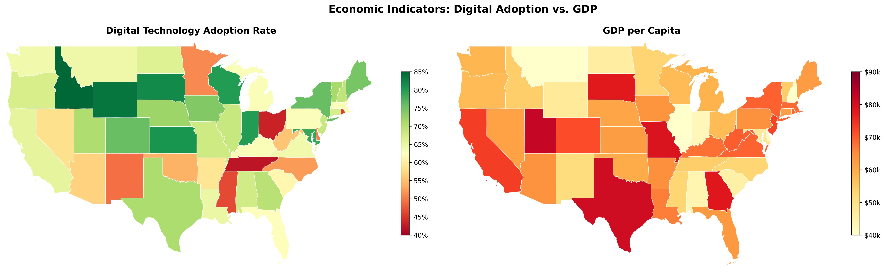

# Firm Digitalization Study

Applied Econometrics Code Sample for Research Position Applications

## Overview

This repository demonstrates end-to-end empirical research capabilities, combining causal inference, structural estimation, and geospatial analysis.

## Key Results

### Difference-in-Differences Estimates

| Event Time | Coefficient | Std. Error | P-value |
|------------|-------------|------------|---------|
| -3 | -0.052 | 0.021 | 0.012 |
| -2 | 0.015 | 0.023 | 0.509 |
| 0 | 0.086 | 0.023 | 0.000 |
| +1 | 0.140 | 0.024 | 0.000 |
| +2 | 0.219 | 0.031 | 0.000 |
| +3 | 0.306 | 0.045 | 0.000 |
| +4 | 0.382 | 0.057 | 0.000 |

**Interpretation**: No significant pre-trends validate parallel trends assumption. Treatment effects grow from 8.6% at adoption to 38.2% after four years.

<p align="center">
  
</p>

## Geographic Distribution of Economic Indicators

### Digital Technology Adoption Rates
<p align="center">
  
</p>

### GDP per Capita by State
<p align="center">
  
</p>

### Technology Employment Share
<p align="center">
  
</p>

### R&D Intensity
<p align="center">
  
</p>

### Multi-Panel Economic Indicators
<p align="center">
  
</p>

### Economic Comparison: Digital Adoption vs GDP
<p align="center">
  
</p>

### Firm Headquarters and Adoption Status
<p align="center">
  
</p>

## Interactive Maps

> **Note**: GitHub cannot render HTML files directly for security reasons. To view the interactive maps:
> 1. Clone this repository locally
> 2. Navigate to `output/figures/`
> 3. Open any `interactive_*.html` file in your web browser

**Available Interactive Maps**:
- `interactive_digital_adoption.html` - Hover over states for detailed adoption rates
- `interactive_gdp_per_capita.html` - Interactive GDP visualization with tooltips
- `interactive_multi_indicators.html` - Toggle between 4 economic indicators
- `interactive_firm_locations.html` - Firm clusters, heatmap, and individual markers
- `maps_index.html` - Navigation hub for all interactive maps

**Features**:
- Zoom and pan controls
- Hover tooltips with detailed statistics
- Layer toggles for multiple indicators
- Marker clustering for firm locations
- Density heatmaps
- Fullscreen mode

**To view locally**:
```bash
git clone https://github.com/xmwu0124/firm-digitalization-study.git
cd firm-digitalization-study/output/figures
open interactive_multi_indicators.html
```

## Methodology

### Causal Inference: Difference-in-Differences
- Event study specification with two-way fixed effects
- Dynamic treatment effect estimation
- Pre-trend testing for identification
- Cluster-robust standard errors

### Structural Estimation: Dynamic Discrete Choice
- Industrial Organization framework
- Bellman equation solution via value function iteration
- Maximum likelihood parameter estimation
- Counterfactual policy simulations

### Geospatial Analysis
- Real US Census Bureau state boundaries (TIGER/Line 2023)
- Professional choropleth maps with proper projections
- Interactive HTML maps with Folium
- Firm location clustering and spatial patterns

## Technical Stack

- **Python 3.9+**: pandas, numpy, scipy
- **Econometrics**: pyfixest, statsmodels
- **Optimization**: JAX (JIT compilation, automatic differentiation)
- **Geospatial**: geopandas, shapely, folium
- **Visualization**: matplotlib, seaborn

## Installation
```bash
git clone https://github.com/xmwu0124/firm-digitalization-study.git
cd firm-digitalization-study
pip install -r requirements.txt
```

## Usage
```bash
# Complete pipeline
python src/run_all.py

# Individual components
python src/02_data_generation/generate_panel.py
python src/03_analysis/did_analysis.py
python src/03_analysis/geographic_visualization.py
python src/03_analysis/interactive_map.py
```

## Author

**Xiaomeng Wu**  
GitHub: [@xmwu0124](https://github.com/xmwu0124)

## License

MIT License

---

**Data Sources**: US Census Bureau TIGER/Line Shapefiles (2023)

**Note**: This repository uses synthetic data for demonstration. The methodological framework is production-ready and applicable to real-world datasets.
